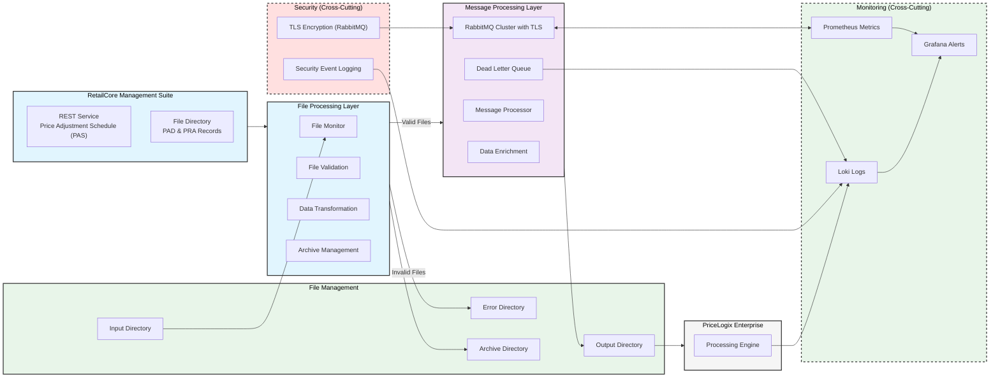

# Enterprise Integration Documentation
## RMS to PriceLogix Integration Specification

### 1. Objective

The goal of this integration is to create a reliable way to move data between the Retail Management Suite (RMS) and the PriceLogix Enterprise Optimizer platform. By connecting these systems, we can improve pricing decisions and turn retail pricing data into useful recommendations.

The system will focus on calculating inventory performance metrics, specifically:
- Adjustment Success Probability
- Price Optimization Benefits

### 2. Scope

This document describes the design and technical details of the RMS to PriceLogix integration. It covers:

- Data transformation process
- Message routing
- Data validation
- File management
- Error handling
- System monitoring

This document explains how data is transformed, archived, and integrated, but it does not go into detail about how RMS systems generate or store the original CSV files. Their internal operations fall outside the scope of this documentation.

### 3. High-Level Design

The integration uses a multi-stage data processing pipeline to handle three main types of records:

1. Price Adjustment Schedule (PAS)
2. Price Adjustment Directive (PAD)
3. Price Restoration Action (PRA)

The RMS system offers two distinct integration patterns, each designed to meet specific business needs:

1. **RMS REST API**: This API provides enterprise-wide access to Price Adjustment Schedule (PAS) data, serving a variety of systems like inventory management, financial forecasting, and price optimization. Secured with OAuth 2.0 using the client credentials grant type, the API ensures controlled yet flexible access across the organization. Our RMS Integration Service is one of the systems leveraging this API—it authenticates, retrieves PAS data, and seamlessly integrates it into downstream processes.

2. **Automated File Exports**: For Price Adjustment Directives (PAD) and Price Restoration Actions (PRA), RMS uses an automated export process. These specialized files are tailored specifically for price optimization workflows. The export operation is embedded within RMS's pricing workflow and generates standardized files, which are then placed in pre-configured directories monitored by our RMS Integration Service instances. This approach ensures efficient and reliable handling of high-volume pricing adjustment data between RMS and PriceLogix.

#### Data Flow Overview

**Price Adjustment Schedule (PAS) Processing:**
Will be implemented in distributed RMS Integration Service instances:
- Each instance handles a dedicated group of store locations
- Daily scheduled data retrieval from RMS REST service per instance
- Convert JSON/CSV to pipe-delimited format
- Standardized mapping to PriceLogix requirements
- Publication to RabbitMQ message queue for downstream processing

**PAD/PRA Processing:**
Will be implemented in PriceLogix Feed Service.
- Process incoming calls from RabbitMQ
- Validate and transform data
- Map to PriceLogix format
- Archive management and file cleanup
- Output to a specific directory

#### Message Processing Model The system employs a hybrid processing model that balances throughput and consistency:
1. **Batch Reception**:
  - Messages are grouped into batches for efficient processing.
  - Batch sizes are configurable based on system load and performance metrics.

2. **Parallel Processing**:
  - Messages within batches are processed concurrently using a controlled concurrency model.
  - Concurrency is controlled via semaphores to prevent overload.
  - Thread pools manage processing resources dynamically.

3. **Ordering Guarantees**:
  - Store group affinity ensures message order is preserved within groups, even with parallel execution.

4. **Processing Guarantees**:
  - Batch-level transaction management ensures consistency.
  - Messages exceeding retry limits are moved to the Dead Letter Queue for further inspection.

**Error Management:**
- Failed files are moved to an error directory
- Automated error notifications
- Transaction logging for audits
- Error recovery procedures

#### Data Governance

To ensure data integrity, the system includes:
- Detailed audit logging
- Secure file handling
- Automated archive management
- Robust error handling
- System health monitoring
#### Message Queue Integration

##### Detailed Queue Configuration

- **TLS Implementation**:
  - Self-signed certificates for development environments.
  - Let's Encrypt for production environments.
- **RabbitMQ Configuration**:
  - Multiple RMS Integration Service instances publish to a shared RabbitMQ exchange
  - User permissions limited to specific queues.
  - Messages are processed in order of arrival regardless of source instance
  - Single PriceLogix Feed Service consumes and processes messages in batches
  - Failed processing attempts trigger configurable retry logic
  - Messages exceeding retry limits move to Dead Letter Queue for investigation
  - Comprehensive monitoring tracks message flow and processing status
- **Monitoring**:
  - RabbitMQ Exporter for Prometheus integration.
  - Metrics include queue depth, message rate, and consumer count.

##### Message Flow

- Multiple RMS Integration Service instances operate on daily schedules for their assigned store groups
- Each instance publishes processed data to the same RabbitMQ exchange
- Messages are grouped into batches for efficient processing, maintaining order within store groups
- PriceLogix Feed Service processes messages in optimized batches with controlled concurrency
- Failed processing attempts trigger retry logic with exponential backoff
- Messages that exceed retry limits move to the Dead Letter Queue
- Dead Letter Queue provides visibility into processing failures and enables recovery procedures



The system implements enterprise-grade reliability and performance optimizations through several key architectural patterns:

**Business Event Processing**

- Asynchronous message processing keeps the system stable during high-volume price adjustments.
- Ensures important pricing updates are delivered.
- Event-driven architecture for real-time price optimization.

**Location Data Management**

- Processing store location data from a monthly updated CSV file.
- Efficient handling of location hierarchy.
- Validation and enrichment of location data.

**Operational Excellence**

- System health monitoring and alerting.
- Real-time performance metrics and business analytics.
- Proactive diagnostics and trend analysis to prevent issues.

**Security and Compliance**

- Strong security protocols for system integration.
- Secure communication between services.
- Comprehensive audit logging to meet compliance needs.
### 4. System Administration and Monitoring

The platform offers reliable management through RabbitMQ tools and integrated dashboards.

**Monitoring and Metrics**

- Use Spring Boot Actuator to track application metrics.
- Prometheus collects data with a 30-day retention period.
- Grafana provides dashboards for application and RabbitMQ performance.
- Alerts are set for:
  - Queue depth over 1000.
  - Processing latency over 500ms.

**Security Setup**

- **TLS Certificates**:
  - RabbitMQ’s built-in TLS support for secure communication.
  - Self-signed certificates for development.
  - Let’s Encrypt for production with automatic renewal.
- **Authentication and Authorization**:
  - RabbitMQ uses usernames and passwords for authentication.
  - Service accounts have restricted permissions to access only necessary queues.
- **Logging**:
  - Logs include security events, like failed logins or unauthorized access.
  - Logs are reviewed regularly to catch any suspicious activity.
### 5. Message Format Specifications

#### 5.1 Price Change Candidate/PRA Format (PAR Output)

##### Input Format
The system accepts source data in a pipe-delimited format with the following structure:

```
ACTION_CODE|ITEM_ID|SKU_LIST|DIFF_ID|LOCATION_TYPE|LOCATION_GROUP|LOCATION_ID|EFFECTIVE_DATE|INVENTORY_DATE|RESET_DATE|CHANGE_TYPE|ADJUSTMENT_AMOUNT|ADJUSTMENT_PERCENT|PRICE_TIER|ACTION_TYPE|PRIORITY|CREATE_DATE|ALL_LOCATIONS
```

Example source record:
```
439-PAD-7-2024-04--1|27671433|1501||0|5000|1501|2024-02-16|||||16||||2024-02-16|N
```

##### Output Format
The system transforms the data into the PriceLogix standardized format:

```
event_id|sku_id|location_key|item_location_status|adjustment_retail_price|source_date|effective_date|adjustment_percentage
```

Example transformed record:
```
439|27671433|1501|PRICE_ADJ|16|2024-02-16|2024-02-22|14.5
```

#### 5.2 Price Adjustment Schedule Format (PSE Output)

##### Input Format
The system receives schedule data through a REST service in JSON format containing:
- Event identifiers
- Fiscal period information
- Multiple adjustment dates
- Event type classifications
- Location applicability

##### Output Format
The data is transformed into a standardized pipe-delimited format:

```
event_id|fiscal_year|adj_date_1|adj_date_2|adj_date_3|adj_date_4|adj_date_5|adj_date_6|inventory_date|event_type
```

Example transformed record:
```
429|2024|2024-10-27||||||2024-12-31|PLANNED
```

### 6. Message Format

#### 6.1 Price Adjustment Candidate (PAD)/Price Restoration Action (PRA)

**Input Format:**  
Input files are in a pipe-delimited format containing raw data records. Fields include action codes, item details, location identifiers, and adjustment details. Below is an example input:

```
ACTION_CODE|ITEM_ID|SKU_LIST|DIFF_ID|LOCATION_TYPE|LOCATION_GROUP|LOCATION_ID|EFFECTIVE_DATE|INVENTORY_DATE|RESET_DATE|CHANGE_TYPE|ADJUSTMENT_AMOUNT|ADJUSTMENT_PERCENT|PRICE_TIER|ACTION_TYPE|PRIORITY|CREATE_DATE|ALL_LOCATIONS
439-PAD-7-2024-04--1|27671433|1501||0|5000|1501|2024-02-16|||||16||||2024-02-16|N
```

#### 6.2 Price Adjustment Schedule (PAS)

**Input Format:**  
The system retrieves schedule data from a REST API in JSON format, including event identifiers, adjustment dates, fiscal periods, and event classifications.

**Example Input Files:**  
The retrieved data is transformed and exported in batch processes, adhering to standardized naming conventions.


#### 6.3 PriceLogix Schedule Entry (PSE)
PriceLogix Schedule Entry (PSE) represents transformed Price Adjustment Schedule data. Each PSE contains event identification, fiscal information, and up to six adjustment dates, providing the foundational scheduling framework for price adjustments.

The JSON data is converted into a pipe-delimited format for downstream processing.
Example:

```
event_id|fiscal_year|adj_date_1|adj_date_2|adj_date_3|adj_date_4|adj_date_5|adj_date_6|inventory_date|event_type
429|2024|2024-10-27||||||2024-12-31|PLANNED
```

#### 6.4 PriceLogix Adjustment Record (PAR)
**PriceLogix Adjustment Record (PAR)** represents transformed Price Adjustment Directives and Price Restoration Actions. Each PAR contains detailed pricing information including item identification, location, and specific adjustment parameters. These records constitute the actual price modifications to be executed according to the schedule defined in PSEs. Files containing price adjustment candidates are uploaded to the monitored source directory, following a naming convention that preserves traceability. After processing, the data is transformed into a standardized pipe-delimited format suitable for the PriceLogix system.
Example:

```
event_id|sku_id|location_key|item_location_status|adjustment_retail_price|source_date|effective_date|adjustment_percentage
439|27671433|1501|PRICE_ADJ|16|2024-02-16|2024-02-22|14.5
```

### 7. Message Transformations

#### 7.1 Price Change Candidate/PRA Transformations

The system applies the following transformation rules:

##### Event Identifier Transformation
- Extracts numeric identifier from the ACTION_CODE field
- Example: From `439-PAD-7-2024-04--1` extracts `439`
- For PRA records: From `PRA-155-1` extracts `155`

##### Location Hierarchy Mapping
- Standard PAD records: Preserves original location hierarchy
- PRA records: Implements location expansion logic
  - Input location ID of '1' triggers expansion to all valid locations
  - Utilizes location master data for expansion
  - Creates individual records for each applicable location

##### Status Code Translation
The system applies contextual status mapping based on record type and action:

For PAD Records:
- ADD action → PRICE_ADJ
- DEL action → PRICE_ADJ_CANCEL

For PRA Records:
- ADD action → PRICE_RESTORE
- DEL action → PRICE_RESTORE_CANCEL

#### 7.2 Price Adjustment Schedule Transformations

##### Event Date Mapping
The system processes multiple adjustment dates from the source data:
- Maps sequential adjustment numbers to corresponding date fields
- Handles up to six adjustment dates per event
- Processes inventory impact dates
- Maintains fiscal period alignment

##### Date Extraction Rules
- Identifies event mark numbers in source data
- Maps mark start dates to corresponding adjustment date fields
- Preserves chronological sequence
- Handles gaps in adjustment sequence
- Maps market out date to inventory date field

##### Type Code Translation
Maintains business context through event type mapping:
- Maps source event codes to standardized PriceLogix classifications
- Preserves event sequencing information
- Maintains relationship between related events
### 8. Feed Frequencies

#### 8.1 Price Change Candidate/PRA

The platform checks hourly for new files in both the main processing and archive directories. If a new file is found, it processes it and moves it to the archive once done. If no new files are found, no output is generated.

The system uses message queues to keep processing reliable during busy times, allowing for:
- Controlled processing during peak times
- Guaranteed price adjustment delivery
- Better resource use
- Recovery from interruptions
#### 8.2 Price Adjustment Schedule

- Multiple RMS Integration Service instances operate on daily schedules
- Each instance processes its assigned store group independently
- Staggered scheduling prevents system-wide resource contention
- Message queue ensures orderly processing regardless of source instance
- Built-in monitoring tracks processing status across all instances
#### 8.3 Message Processing SLAs

- Maximum message processing time: 500ms
- Queue depth threshold: 1000 messages
- Message retry policy: 3 attempts with exponential backoff
- Dead letter queue processing: Every 15 minutes

### 9. File Name Formats

## 9.1 Price Change Candidate/PRA

Output files follow the standardized naming convention:
```
RMS_PAD_RetailCore_YYYYMMDDHHMISS.csv
```

The timestamp component is preserved from the input file name, ensuring one-to-one traceability between source and output files. This timestamp reflects the completion time of the file generation process in the RMS system.

## 9.2 Price Adjustment Schedule

Output files adhere to the format:
```
RMS_PAS_RetailCore_YYYYMMDDHHMISS.csv
```

The timestamp in these files reflects the successful processing time within the integration platform.

### 10. Failures and Fault Tolerance

The integration platform implements a robust high-availability architecture utilizing dual-server deployment. While one server operates as the primary processing node, the secondary server remains in standby mode. In the event of primary server failure, the application can be manually activated on the backup server, accompanied by the initialization of backup file routing processes.

#### 10.1 Error Handling for Price Change Processing

The system implements comprehensive error management:

- Files that encounter processing errors are automatically redirected to a designated error directory
- This automated routing prevents processing loops where the system might repeatedly attempt to process corrupt files
- The error directory maintains a complete audit trail of processing exceptions
- Error conditions are logged with detailed context for troubleshooting

The integration platform continues processing subsequent files even when errors occur, ensuring system resilience and continuous operation. Each error event generates appropriate logging entries with contextual information about the specific file and error conditions.

This architecture ensures business continuity while maintaining data integrity and providing clear visibility into any processing exceptions.

#### 10.2 Performance Optimization

The system implements several performance enhancement strategies:

Location Data Management

- Monthly location hierarchy updates
- Intelligent caching of frequently accessed location data
- Optimized location expansion for price adjustments

Processing Optimization

- Intelligent workload distribution
- Resource utilization monitoring
- Performance threshold management
- Automated scaling capabilities

### 11. Reporting and Alerts

The platform keeps detailed activity logs in a JSON format, which helps with system monitoring, troubleshooting, and compliance.

#### Logging Levels

The system has three main logging levels:

- **Informational**: Logs routine activities and successful operations.
- **Warning**: Captures non-critical issues like retries or minor problems.
- **Error**: Logs critical issues affecting message delivery or file processing.

#### Log Entry Structure

Each log entry follows a standard JSON format for easy parsing and analysis:

```json
{
  "log": {
    "dateTime": "2024-03-28 14:49:53.902",
    "level": "ERROR",
    "thread": "ProcessingController",
    "class": "org.integration.processor.Context",
    "message": "Failed to process file: price_adjustments_2024.csv. Reason: Schema validation error."
  }
}
```

#### Monitoring Integration

The platform uses **Apache Camel's JMX support** along with tools like Prometheus and Grafana for monitoring.

- **Camel Route Monitoring**:
  - JMX tracks route metrics, such as message counts, processing times, and error rates.
  - Metrics like successful and failed exchanges are monitored in real-time.

- **Prometheus and Grafana**:
  - JMX metrics are exported to Prometheus for visualization and alerts in Grafana.
  - Grafana dashboards display route performance metrics like latency and throughput for analysis.

- **System Health Alerts**:
  - Prometheus alerts are set for critical events like route failures or performance issues.

#### Centralized Logging with Loki

JMX monitoring works with Loki to provide insights connected to application logs.

- **Setup**: All logs, including JMX logs, are sent to a Loki instance.
- **Integration**: Logs and metrics are accessible in Grafana for:
  - Real-time log visualization.
  - Filtering to correlate events with logs and metrics.
  - Historical analysis for troubleshooting.
- **Retention Policies**: Configurable retention for logs to meet storage and compliance needs.
- **Alerting**: Logs are tagged for easy event correlation, and Prometheus alerts include log details for quick issue resolution.
