### **PAS Data Retrieval Use Case**

**Use Case Description**: Retrieve PAS data via a scheduled job, transform it, and publish it to RabbitMQ for downstream processing.

**Scope**: End-to-end data retrieval and transformation for PAS records.

**Level**: User Goal

**Primary Actor**: RMS Integration Service

**Stakeholders and Interests**:

- **Retail Management Suite (RMS)**: Provides PAS data and expects timely and reliable retrieval.
- **PriceLogix Enterprise Optimizer**: Requires transformed PAS data in the correct format for further processing.
- **System Administrators**: Need reliable scheduling, error logs, and monitoring capabilities to ensure uninterrupted operations.

**Preconditions**:

- RMS REST API is operational.
- OAuth client credentials are configured and valid
- Token acquisition is functioning
- RMS Integration Service is running and has valid configurations.
- RabbitMQ is configured and available.

**Postconditions**:

- Successfully transformed PAS data is published to RabbitMQ.
- Logs are generated for both successful and failed operations.

**Main Success Scenario Step by Step**:

1. A daily cron job triggers the RMS Integration Service at the scheduled interval.
2. The service sends a GET request to the RMS REST API.
3. The API responds with PAS data in JSON format.
4. The service validates the data structure and checks for mandatory fields:
   - Validates event identifiers for correct numeric format
   - Verifies fiscal period information completeness
   - Ensures adjustment dates follow chronological order
   - Validates event type classifications against allowed values
   - Confirms all required location applicability fields are present
5. Valid data is transformed into PSE pipe-delimited format, following strict field mapping rules.
6. Each PSE record undergoes format-specific validation:
   - Verifies proper fiscal year formatting
   - Validates chronological sequence of adjustment dates (adj_date_1 through adj_date_6)
   - Ensures event type code matches approved PriceLogix values
   - Confirms inventory date formatting and logical placement
7. The service publishes the validated PSE data to a RabbitMQ exchange.
8. The service logs the operation, including the total number of records processed and any issues encountered.

**Extensions, Other Scenarios, and Alternatives**:

- **E1: RMS API is Unreachable**:
    - Step 2 fails.
    - Log the error with details about the failure.
    - Retry the request after a configurable interval, as per the backoff policy.
    - If retries exceed the limit, escalate by triggering an alert.
- **E2: Data Validation Fails**:
    - Step 4 fails.
    - Log the validation errors.
    - Skip invalid records and continue processing valid entries.

**Special Requirements**:

- The cron schedule defaults to daily execution but can be reconfigured as needed.
- Error logs should be accessible for debugging.
- The service must support retries for temporary API unavailability.

**Data Variation List**:

- **Input**: JSON data containing fields such as event identifiers, adjustment dates, fiscal periods, and event types called Price Adjustment Schedule (PAS).
- **Output**: PriceLogix Schedule Entry (PSE) data in standardized pipe-delimited format.

**Frequency Occurrence**: Typically runs once daily, as per the cron job schedule.

**Trigger**: Daily cron job execution.

**Actors**:

- **Primary**: RMS Integration Service
- **Supporting**: RMS REST API, RabbitMQ

**Goals**:

- Ensure timely and accurate transformation of PAS data for downstream use.
- Maintain traceability and error handling for all operations.

**Failed Endings**:

- PAS data is not retrieved or published due to RMS API unavailability or critical data validation errors.

**Miscellaneous**:

- Future improvement: Introduce health checks for the RMS REST API to reduce the frequency of failed requests.
- Consider monitoring and alerting for data volume discrepancies, ensuring expected records are retrieved.

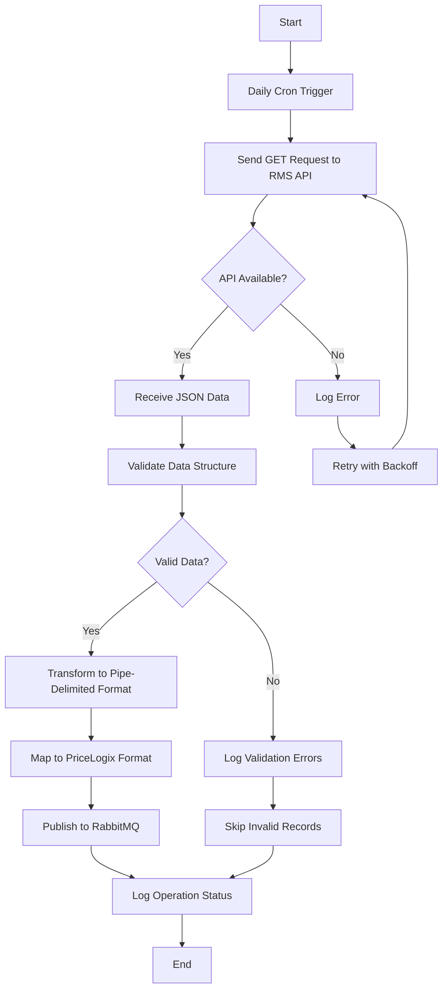
### **PAD/PRA File Processing Use Case**

**Use Case Description**: Monitor and process PAD/PRA files, transform the data, and output results for PriceLogix integration.

**Scope**: End-to-end processing of PAD/PRA files, including validation, transformation, and error handling.

**Level**: User Goal

**Primary Actor**: PriceLogix Feed Service

**Stakeholders and Interests**:

- **Retail Management Suite (RMS)**: Provides PAD/PRA files for processing.
- **PriceLogix Enterprise Optimizer**: Requires transformed PAD/PRA data for pricing decisions.
- **System Administrators**: Need reliable error handling, traceability, and logs for processed files.

**Preconditions**:

- PAD/PRA files are generated and available in the monitored input directory.
- PriceLogix Feed Service is running with correct configurations.
- Output, archive, and error directories are configured and accessible.
- File naming conventions comply with the standardized patterns defined in the modernization master plan.

**Postconditions**:

- Successfully transformed PAD/PRA data is output to the designated directory.
- Failed files are moved to an error directory with detailed logs.
- Processed files are archived for traceability.

**Main Success Scenario Step by Step**:

1. PriceLogix Feed Service monitors the input directory for new PAD/PRA files.
2. Upon detecting a file, the service validates its format and header information against the standardized naming conventions.
3. For valid files:
   - The service reads the file content line by line.
   - Performs PAR-specific data validation:
     * Validates event_id numeric format and range
     * Verifies sku_id exists and follows naming conventions
     * Confirms location_key matches valid store locations
     * Validates item_location_status against allowed values
     * Checks adjustment_retail_price and adjustment_percentage for valid ranges
     * Ensures date fields follow required format (YYYY-MM-DD)
   - Transforms each record according to PAR format requirements:
     * Maps source fields to PAR structure
     * Applies business rules for status code translation
     * Handles location hierarchy expansion for PRA records
   - Validates transformed PAR records for completeness and consistency
   - Writes the processed data to the output directory.
   - Moves the original file to the archive directory.
4. For invalid or partially processed files:
    - Log detailed error information.
    - Move the file to the error directory for manual review.
5. Generate a summary log of all processed, archived, and failed files.

**Extensions, Other Scenarios, and Alternatives**:

- **E1: File Validation Fails**:
    - Step 2 fails.
    - Log the validation error with file details.
    - Move the file to the error directory and proceed with the next file.
- **E2: Directory Unreachable**:
    - Log the failure and retry accessing the directory after a configurable interval.
    - Escalate to administrators if retries fail.
- **E3: Partial File Processing**:
    - Log each record that fails transformation.
    - Process remaining valid records and complete file transformation.

**Special Requirements**:

- Processed files must follow a standard naming convention in the archive directory for easy retrieval.
- Ensure error logs are detailed enough to assist in troubleshooting.
- Operations must support atomic file handling to prevent data loss during processing.

**Data Variation List**:

- **Input**: PAD/PRA files in pipe-delimited format containing action codes, item details, and adjustment details
- **Output**: PriceLogix Adjustment Record (PAR) data in standardized format.

**Frequency Occurrence**: Files are processed as they are detected in the monitored directory, typically on an hourly or as-needed basis.

**Trigger**: Detection of a new PAD/PRA file in the monitored input directory.

**Actors**:

- **Primary**: PriceLogix Feed Service
- **Supporting**: File System, System Administrators

**Goals**:

- Ensure timely and accurate transformation of PAD/PRA data for downstream use.
- Maintain traceability and error handling for all file operations.

**Failed Endings**:

- Files remain unprocessed or in the error directory due to critical validation or transformation failures.

**Miscellaneous**:

- Future improvement: Automate notifications for administrators when files are moved to the error directory.
- Consider implementing a dashboard for file processing metrics, such as counts of processed, archived, and failed files.

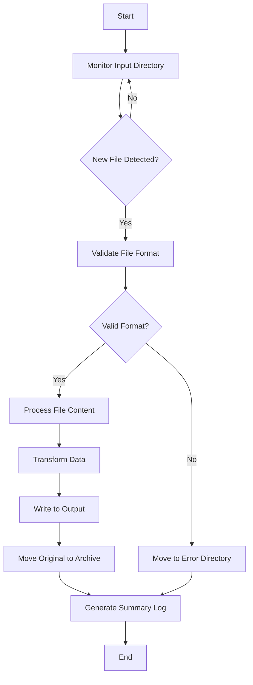

### **Message Queue Integration Use Case**

**Use Case Description**: Publish and consume messages using RabbitMQ for asynchronous data exchange.

**Scope**: Reliable message exchange between RMS Integration Service instances and the PriceLogix Feed Service.

**Level**: Subfunction

**Primary Actor**: RabbitMQ

**Stakeholders and Interests**:

- **RMS Integration Service**: Expects reliable message publishing to RabbitMQ.
- **PriceLogix Feed Service**: Requires sequential message consumption.
- **System Administrators**: Need visibility into queue health and processing metrics.

**Preconditions**:

- RabbitMQ is configured and operational.
- Services are authenticated to interact with RabbitMQ.
- RabbitMQ exchange, queues, and routing keys are defined.

**Postconditions**:

- Messages from RMS Integration Service are successfully published to RabbitMQ.
- Messages are consumed sequentially by the PriceLogix Feed Service.
- Dead Letter Queue (DLQ) contains unprocessed messages due to errors or retry exhaustion.

**Main Success Scenario Step by Step**:

1. RMS Integration Service transforms PAS data into the required format.
2. The service establishes a connection with RabbitMQ.
3. Transformed data is published as a message to the RabbitMQ exchange.
4. RabbitMQ routes the message to the appropriate queue.
5. PriceLogix Feed Service retrieves the message from the queue.
6. The service processes the message and generates output for downstream systems.
7. Successfully processed messages are acknowledged, removing them from the queue.

**Extensions, Other Scenarios, and Alternatives**:

- **E1: Connection Error During Publishing**:
    - Step 2 fails.
    - Log the error and retry publishing after a configurable interval.
- **E2: Message Processing Fails**:
    - Step 6 fails.
    - Log the failure and retry processing based on the retry policy.
    - If retries exceed the limit, move the message to the DLQ.

**Special Requirements**:

- Ensure TLS encryption for RabbitMQ connections.
- Dead Letter Queue processing should run every 15 minutes to reattempt failed messages.
- Monitor queue depth, message age, and consumer lag metrics.

**Data Variation List**:

- Input: Messages containing transformed PAS/PAD/PRA data with metadata.
- Output: Messages processed and acknowledged or moved to the DLQ.

**Frequency Occurrence**: Messages are published and consumed in real time as PAS/PAD/PRA processing occurs.

**Trigger**: PAS processing completion or detection of new PAD/PRA files.

**Actors**:

- **Primary**: RabbitMQ
- **Supporting**: RMS Integration Service, PriceLogix Feed Service

**Goals**:

- Reliable and secure message delivery for downstream processing.

**Failed Endings**:

- Messages are moved to the DLQ if they cannot be processed after maximum retries.

**Miscellaneous**:

- Future improvement: Implement message priority levels to expedite critical messages.
- Add monitoring alerts for prolonged queue depth exceeding thresholds.

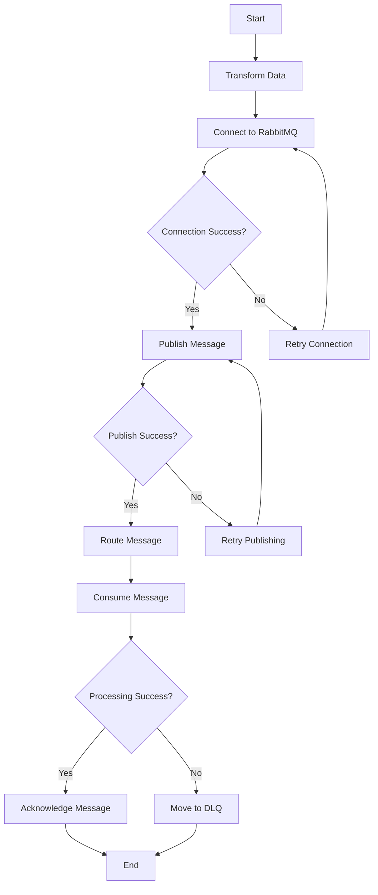
### **File Management Use Case**

**Use Case Description**: Manage PAD/PRA file lifecycle, including archiving processed files, handling errors, and cleaning up outdated files, within each service instance's directory structure.

**Scope**: Comprehensive file management operations for each service instance.

**Level**: Subfunction

**Primary Actor**: PriceLogix Feed Service

**Stakeholders and Interests**:

- **System Administrators**: Require automated file handling to maintain organization and prevent storage issues.
- **Developers**: Need clear operational rules for managing files across multiple service instances.
- **Business Stakeholders**: Depend on consistent file operations to ensure uninterrupted processing and traceability.

**Preconditions**:

- Input, output, archive, and error directories are configured and accessible for each service instance.
- Each service instance manages its own set of directories based on its assigned store group.

**Postconditions**:

- Successfully processed files are archived in the respective service instance's archive directory.
- Failed files are moved to the error directory.
- Archived files older than the defined retention period are deleted.

**Main Success Scenario Step by Step**:

1. PriceLogix Feed Service detects new PAD/PRA files in the input directory of a specific service instance.
2. The service processes valid files:
    - Transforms and outputs the processed data to the instance’s output directory.
    - Moves the original file to the instance’s archive directory.
3. For invalid or partially processed files:
    - Logs the errors with sufficient detail for troubleshooting.
    - Moves the file to the instance’s error directory.
4. A periodic cleanup job:
    - Scans the archive directory of each service instance.
    - Deletes files older than the defined retention period (e.g., one week).
5. Generate a summary log of all file operations, including processed, archived, failed, and cleaned-up files.

**Extensions, Other Scenarios, and Alternatives**:

- **E1: Input Directory Unreachable**:
    - Log the failure and retry accessing the directory after a configurable interval.
    - Escalate to administrators if retries fail.
- **E2: File Move Operation Fails**:
    - Log the failure with file details.
    - Skip the file and proceed with the next one.
- **E3: Cleanup Job Fails**:
    - Log the failure and notify administrators for manual intervention.

**Special Requirements**:

- Ensure atomic file operations to prevent partial moves or data loss.
- Logs should include instance-specific identifiers to distinguish operations across distributed services.

**Data Variation List**:

- **Input**: PAD/PRA files located in the instance-specific input directory.
- **Output**: Transformed files written to the instance-specific output directory.
- **Archive**: Processed files moved to the instance-specific archive directory.
- **Error**: Invalid or partially processed files moved to the instance-specific error directory.

**Frequency Occurrence**: File handling occurs in real-time as files are detected, and cleanup jobs run periodically (e.g., daily or weekly).

**Trigger**: Detection of new PAD/PRA files or scheduled execution of cleanup jobs.

**Actors**:

- **Primary**: PriceLogix Feed Service
- **Supporting**: File System, System Administrators

**Goals**:

- Ensure organized and efficient file handling for each service instance.
- Prevent storage issues by maintaining a clean and consistent directory structure.

**Failed Endings**:

- Files remain unprocessed or unarchived due to directory inaccessibility or operation failures.

**Miscellaneous**:

- Future improvement: Integrate file management logs with a centralized monitoring system for real-time visibility.
- Consider adding administrator notifications for cleanup errors or excessive files in the error directory.

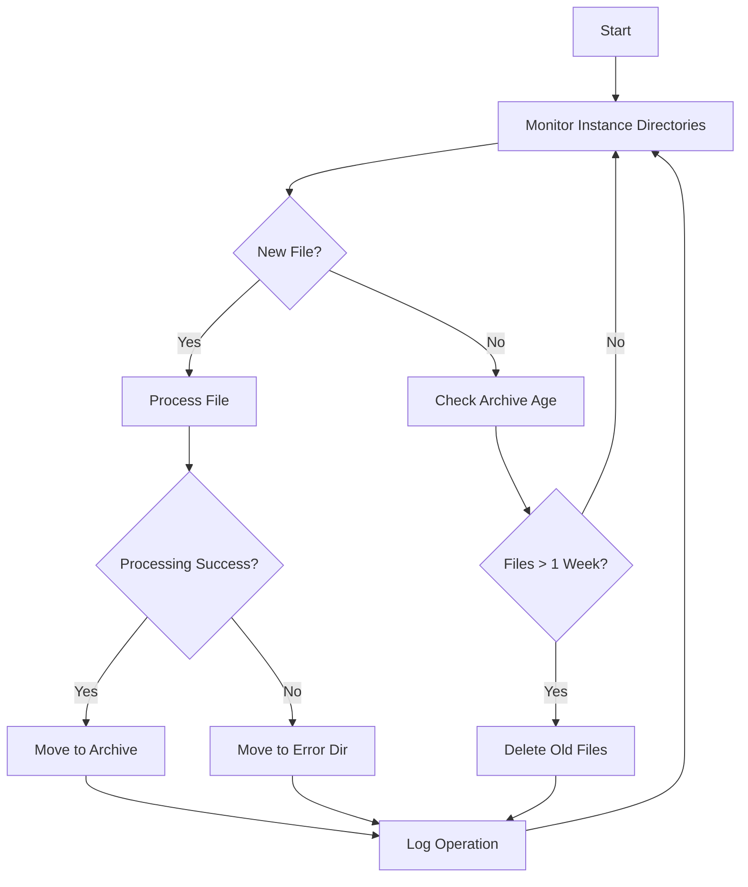

### **Monitoring and Observability Use Case**

**Use Case Description**: Monitor system health, collect instance-specific and system-wide metrics, and visualize performance data to ensure smooth operation and timely issue detection.

**Scope**: End-to-end monitoring and observability for individual service instances and the overall system.

**Level**: User Goal

**Primary Actor**: Monitoring System (Prometheus)

**Stakeholders and Interests**:

- **System Administrators**: Require real-time visibility into instance-specific and system-wide performance metrics to ensure reliability.
- **Developers**: Need detailed metrics and logs for debugging and optimizing individual service instances.
- **Business Stakeholders**: Depend on system stability and performance for consistent pricing operations.

**Preconditions**:

- Prometheus is operational and configured to scrape metrics from all service instances and RabbitMQ.
- Grafana dashboards are set up with instance-specific and system-wide views.
- RabbitMQ Exporter and Spring Boot Actuator endpoints are configured for all services.

**Postconditions**:

- Instance-specific metrics (e.g., processing rates, error counts) and system-wide metrics (e.g., queue depth) are collected and stored for visualization.
- Alerts are generated for predefined threshold breaches.
- Logs are available in Loki for detailed analysis.

**Main Success Scenario Step by Step**:

1. Each service instance exposes metrics at its `/actuator/prometheus` endpoint.
2. Prometheus scrapes metrics from:
    - Each service instance's endpoint for instance-specific metrics (e.g., processing latency, error rates).
    - RabbitMQ Exporter for queue-specific metrics (e.g., depth, message age).
3. Metrics are stored in Prometheus with a retention period of 30 days.
4. Grafana visualizes metrics on dashboards:
    - Instance-specific dashboards show metrics for each service instance (e.g., PAS retrieval time for specific store groups).
    - System-wide dashboards aggregate metrics across instances (e.g., total queue depth).
5. Alerts are configured in Prometheus for:
    - Queue depth exceeding 1000 messages.
    - Instance-specific processing latency exceeding 500ms.
    - Error rates above a predefined threshold for any instance.
6. When an alert is triggered:
    - Prometheus sends a notification to the configured channels (e.g., email, Slack).
    - System administrators investigate the issue using Grafana dashboards and Loki logs.
7. Logs from all instances are aggregated in Loki, enabling administrators to filter by instance ID or timestamp.

**Extensions, Other Scenarios, and Alternatives**:

- **E1: Metric Endpoint Unavailable**:
    - Log the failure and exclude the instance from scraping temporarily.
    - Retry scraping after a configurable interval.
- **E2: Alert Suppression**:
    - Temporarily suppress alerts for known issues under investigation.
- **E3: Grafana Dashboard Corruption**:
    - Restore dashboards from a backup configuration.

**Special Requirements**:

- Include instance-specific identifiers in all logs and metrics to enable granular monitoring.
- Ensure alerts provide actionable information, including affected instances and thresholds breached.

**Data Variation List**:

- Metrics:
    - Instance-specific: Processing latency, error counts, throughput.
    - System-wide: Queue depth, total message processing rate, DLQ size.
- Logs:
    - Informational: Routine operations (e.g., task completion).
    - Warnings: Performance degradation.
    - Errors: Critical failures.

**Frequency Occurrence**:

- Metrics are scraped every 15 seconds.
- Alerts are generated in real time as thresholds are breached.

**Trigger**: Periodic scraping by Prometheus or threshold breaches in monitored metrics.

**Actors**:

- **Primary**: Prometheus
- **Supporting**: Grafana, Loki, Spring Boot Actuator, RabbitMQ Exporter

**Goals**:

- Ensure instance-specific and system-wide observability.
- Provide actionable insights for timely resolution of issues.

**Failed Endings**:

- Metrics and logs are unavailable due to misconfigured endpoints or system failures, delaying issue detection and resolution.

**Miscellaneous**:

- Future improvement: Implement business-level metrics, such as successful pricing adjustment counts, to provide more actionable insights.
- Consider integrating Grafana alerts with a notification service like PagerDuty for immediate escalation of critical issues.

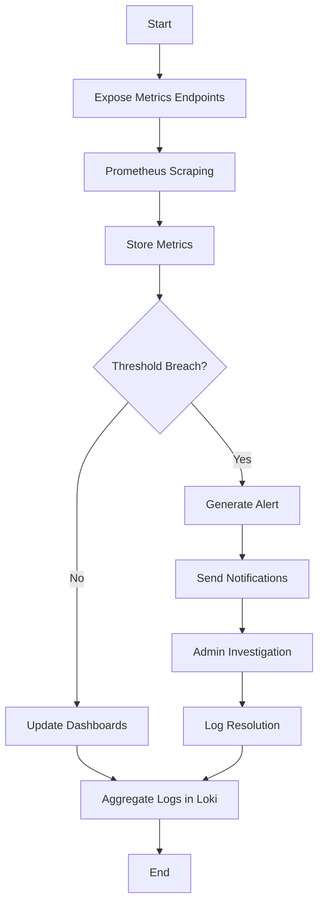
### **Security and Compliance Use Case**

**Use Case Description**: Secure system communication and ensure compliance with auditing and data protection standards.

**Scope**: Protect data integrity and confidentiality during processing and transmission between services.

**Level**: Subfunction

**Primary Actor**: Security Framework (TLS, Authentication Mechanisms)

**Stakeholders and Interests**:

- **System Administrators**: Need secure and traceable operations to maintain system integrity and prevent unauthorized access.
- **Developers**: Require straightforward implementation and configuration of security features.
- **Business Stakeholders**: Depend on compliance with data protection regulations and secure handling of sensitive pricing data.

**Preconditions**:

- TLS certificates are installed and configured for RabbitMQ and services.
- RabbitMQ credentials (username/password) are set and distributed securely.
- Logging framework is configured to capture security-related events.

**Postconditions**:

- Communication between services is encrypted using TLS.
- Unauthorized access attempts are logged for review.
- Audit trails are maintained for all critical operations.

**Main Success Scenario Step by Step**:

1. TLS certificates are generated and installed:
    - Self-signed certificates are used for development.
    - Let’s Encrypt certificates are used for production.
2. RabbitMQ is configured to enforce TLS for all connections.
3. Services establish encrypted connections to RabbitMQ during startup.
4. Services authenticate to RabbitMQ using securely stored credentials.
5. Security events, such as failed login attempts or unauthorized access, are logged in JSON format.
6. Audit logs are maintained for critical operations, including:
    - Message publication and consumption.
    - File access and modifications.
    - Alert triggers and resolutions.

**Extensions, Other Scenarios, and Alternatives**:

- **E1: Certificate Expiry**:
    - Log the issue and generate alerts.
    - Attempt to renew certificates automatically (Let’s Encrypt).
- **E2: Authentication Failure**:
    - Log the failed attempt and notify administrators.
    - Lock out accounts after a configurable number of failures.
- **E3: Unauthorized File Access**:
    - Log the access attempt and move the file to a secure quarantine location.

**Special Requirements**:

- Support for automatic certificate renewal for production environments.
- Role-based access control (RBAC) for RabbitMQ users.
- Logs must comply with data protection regulations.

**Data Variation List**:

- Certificates:
    - Self-signed for development.
    - Let’s Encrypt for production.
- Logs:
    - Informational: Routine connection events.
    - Warnings: Suspicious activity.
    - Errors: Security violations, such as failed authentications.

**Frequency Occurrence**: Security mechanisms are engaged for every connection and operation.

**Trigger**: Connection requests or operational events requiring authentication and authorization.

**Actors**:

- **Primary**: Security Framework
- **Supporting**: RabbitMQ, Logging Framework, System Administrators

**Goals**:

- Protect data during transmission and processing.
- Ensure compliance with regulatory and audit requirements.

**Failed Endings**:

- Services fail to connect to RabbitMQ due to misconfigured or expired certificates.
- Unauthorized access is not logged due to logging misconfiguration.

**Miscellaneous**:

- Future improvement: Implement IP whitelisting for RabbitMQ connections.
- Consider integrating a third-party identity provider (e.g., OAuth) for enhanced security.

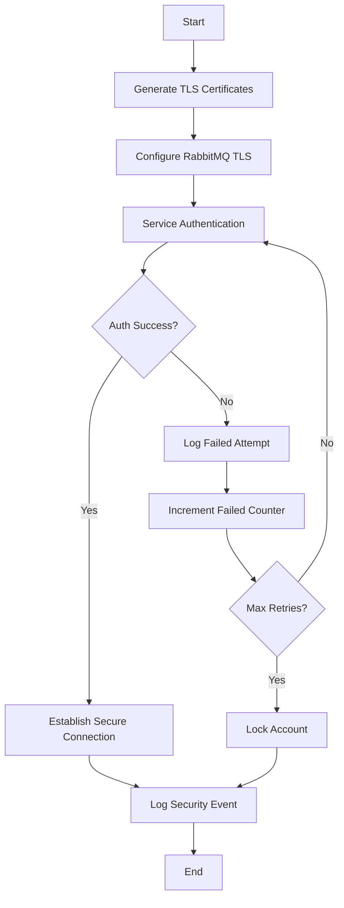
### **Dead Letter Queue Processing Use Case**

**Use Case Description**: Process failed messages from the Dead Letter Queue (DLQ) for reprocessing or archival.

**Scope**: Reliable handling of unprocessed messages to ensure system stability and maintain traceability.

**Level**: Subfunction

**Primary Actor**: PriceLogix Feed Service

**Stakeholders and Interests**:

- **System Administrators**: Require visibility into failed messages and tools to reprocess or archive them.
- **Business Stakeholders**: Depend on reliable message handling to prevent data loss or processing gaps.

**Preconditions**:

- RabbitMQ is operational and configured with a DLQ.
- Failed messages are routed to the DLQ.

**Postconditions**:

- Successfully reprocessed messages are moved back to the main queue.
- Messages that cannot be reprocessed are archived with detailed logs.

**Main Success Scenario Step by Step**:

1. PriceLogix Feed Service periodically queries the DLQ for failed messages.
2. For each message:
    - Validate the message content.
    - Determine whether the message can be reprocessed.
3. If the message is valid for reprocessing:
    - Move it back to the main RabbitMQ queue for reprocessing.
    - Log the reprocessing attempt.
4. If the message is not valid for reprocessing:
    - Archive the message for manual review.
    - Log the failure with detailed context.
5. Generate a summary report of DLQ processing results.

**Extensions, Other Scenarios, and Alternatives**:

- **E1: Message Validation Fails**:
    - Log the validation error.
    - Archive the invalid message.
- **E2: RabbitMQ Unreachable**:
    - Log the connection failure.
    - Retry querying the DLQ after a configurable interval.

**Special Requirements**:

- Provide administrators with a dashboard or CLI tool for manual intervention.
- Ensure archived messages are stored securely and are easily retrievable.

**Data Variation List**:

- Input: Messages in the DLQ with metadata.
- Output: Successfully reprocessed messages or archived failed messages.

**Frequency Occurrence**: Every 15 minutes or as configured.

**Trigger**: Scheduled task or manual invocation.

**Actors**:

- **Primary**: PriceLogix Feed Service
- **Supporting**: RabbitMQ, System Administrators

**Goals**:

- Minimize message loss and maintain system reliability by handling failed messages appropriately.

**Failed Endings**:

- Messages remain in the DLQ due to RabbitMQ connectivity issues or invalid message content.

**Miscellaneous**:

- Future improvement: Implement a retry policy for messages within the DLQ itself before routing them to archival.

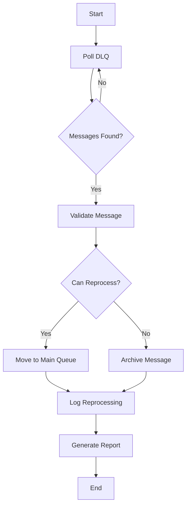

### **Certificate Management Use Case**

**Use Case Description**: Manage TLS certificates for secure communication between services and RabbitMQ, including generation, renewal, and deployment.

**Scope**: End-to-end management of TLS certificates for RabbitMQ and associated services.

**Level**: Subfunction

**Primary Actor**: Security Framework

**Stakeholders and Interests**:

- **System Administrators**: Require tools to manage certificates with minimal disruption to service operations.
- **Developers**: Need clear guidelines for implementing secure connections in development and production environments.
- **Business Stakeholders**: Depend on secure and uninterrupted system communication to meet compliance and operational standards.

**Preconditions**:

- RabbitMQ is configured to use TLS for secure communication.
- Tools for certificate generation and renewal (e.g., OpenSSL, Let’s Encrypt) are available.
- Services are configured to use RabbitMQ with secure connections.

**Postconditions**:

- Certificates are deployed and active for all RabbitMQ connections.
- Expired certificates are replaced without significant downtime.
- Logs are generated for all certificate-related operations.

**Main Success Scenario Step by Step**:

1. A scheduled task or manual invocation checks the validity of existing RabbitMQ TLS certificates.
2. If a certificate is nearing expiry:
    - Generate a new certificate:
        - Use self-signed certificates for development environments.
        - Use Let’s Encrypt for production environments.
    - Validate the new certificate.
3. Deploy the new certificate to RabbitMQ by:
    - Replacing the existing certificate file with the new one.
    - Restarting RabbitMQ to apply the updated certificate.
4. Notify services to reconnect using the new certificate.
5. Log the certificate update operation, including the new certificate’s expiration date and the operation status.

**Extensions, Other Scenarios, and Alternatives**:

- **E1: Certificate Generation Fails**:
    - Log the failure and notify administrators.
    - Retry certificate generation after addressing the issue (e.g., incorrect configuration, connectivity issues).
- **E2: RabbitMQ Restart Fails**:
    - Log the failure and escalate to administrators for manual intervention.
    - Revert to the previous certificate if the issue persists.
- **E3: Certificate Deployment Delays**:
    - Notify administrators of the delay.
    - Allow temporary connections with the previous certificate until the issue is resolved.

**Special Requirements**:

- Certificates must meet RabbitMQ’s TLS configuration requirements:
    - Certificate and key files must be placed in RabbitMQ’s configured `tls_cert_path`.
    - The RabbitMQ configuration file (`rabbitmq.conf`) must point to the updated certificate and key files.
- Ensure automated renewal for production environments using Let’s Encrypt.
- Administrators must be alerted at least 7 days before certificate expiry.

**Data Variation List**:

- Certificates:
    - Self-signed certificates for non-production environments.
    - Certificates from Let’s Encrypt for production.
- Logs:
    - Informational: Successful updates.
    - Warnings: Imminent certificate expiry.
    - Errors: Failed updates or deployments.

**Frequency Occurrence**:

- Certificate checks occur daily or weekly.
- Renewal is performed as certificates near expiry (e.g., within 30 days of expiration).

**Trigger**:

- Scheduled task or manual invocation.

**Actors**:

- **Primary**: Security Framework
- **Supporting**: RabbitMQ, System Administrators

**Goals**:

- Ensure uninterrupted secure communication between services and RabbitMQ.
- Maintain compliance with security standards through timely certificate management.

**Failed Endings**:

- RabbitMQ connections fail due to expired certificates.
- Certificate deployment is delayed, causing potential security vulnerabilities.

**Miscellaneous**:

- Future improvement: Integrate certificate management with centralized monitoring tools to provide real-time alerts for upcoming expirations.
- Consider adding automated certificate backup to avoid data loss during updates.

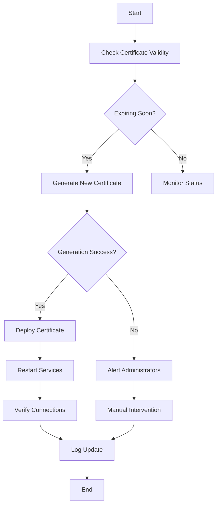

### **Alert Management Use Case**

**Use Case Description**: Detect system anomalies, trigger instance-level and system-wide alerts, and notify administrators to enable timely issue resolution.

**Scope**: Comprehensive monitoring and alerting for instance-level and system-wide metrics.

**Level**: User Goal

**Primary Actor**: Monitoring System (Prometheus)

**Stakeholders and Interests**:

- **System Administrators**: Require timely alerts for anomalies to ensure reliable operation of individual services and the overall system.
- **Developers**: Need detailed alerts to debug issues and optimize system performance.
- **Business Stakeholders**: Depend on the system's stability and prompt resolution of issues to maintain pricing operations.

**Preconditions**:

- Prometheus is configured with alerting rules for both instance-level and system-wide metrics.
- Notification channels (e.g., email, Slack) are set up and operational.
- Grafana dashboards are available for visualizing both instance-level and system-wide metrics.

**Postconditions**:

- Alerts are triggered when predefined thresholds are breached.
- Notifications are sent to administrators with actionable details.
- Alerts are logged for traceability and analysis.

**Main Success Scenario Step by Step**:

1. Prometheus continuously scrapes metrics from:
    - Instance-specific endpoints (e.g., `/actuator/prometheus`) for service health and processing metrics.
    - RabbitMQ Exporter for system-wide metrics (e.g., aggregate queue depth).
2. An alert rule is breached:
    - Instance-level (e.g., high processing latency or error rates for a specific service).
    - System-wide (e.g., queue depth exceeding 1000 messages).
3. Prometheus triggers an alert:
    - Includes details about the breached threshold, affected instance(s), and metric values.
4. The alert is sent to the configured notification channels (e.g., email, Slack).
5. System administrators investigate the issue using:
    - Instance-specific Grafana dashboards for service health and error logs.
    - System-wide dashboards for aggregated metrics and RabbitMQ performance.
6. Administrators resolve the issue and acknowledge the alert in the monitoring system.

**Extensions, Other Scenarios, and Alternatives**:

- **E1: Notification Failure**:
    - Log the failure and retry sending the notification after a configurable interval.
    - Escalate to an alternative channel (e.g., SMS) if retries fail.
- **E2: False Positive Alerts**:
    - Suppress similar alerts temporarily and adjust the threshold or rule logic if necessary.
- **E3: Multiple Simultaneous Alerts**:
    - Prioritize alerts based on severity and notify administrators of the critical ones first.

**Special Requirements**:

- Alerts must distinguish between instance-level issues (e.g., single service downtime) and system-wide issues (e.g., high queue depth affecting all services).
- Alert messages should include sufficient context to enable quick resolution:
    - Affected service or system component.
    - Breached threshold and current metric value.
    - Suggested troubleshooting steps.
- Notification channels must support redundancy to ensure delivery.

**Data Variation List**:

- Metrics:
    - **Instance-Level**: Processing latency, error rates, uptime, resource utilization.
    - **System-Wide**: Aggregate queue depth, message age, total error rate.
- Notifications:
    - Email.
    - Slack.
    - Optional: SMS or PagerDuty.

**Frequency Occurrence**: Alerts are generated in real-time whenever thresholds are breached.

**Trigger**: Breach of predefined alerting thresholds in Prometheus.

**Actors**:

- **Primary**: Monitoring System (Prometheus)
- **Supporting**: Grafana, Notification Channels, RabbitMQ Exporter, System Administrators

**Goals**:

- Detect and resolve anomalies at both the instance and system-wide levels promptly.
- Minimize downtime and performance degradation through actionable alerts.

**Failed Endings**:

- Alerts are not delivered, delaying issue detection and resolution.
- Administrators are overwhelmed by false positives or redundant alerts.

**Miscellaneous**:

- Future improvement: Integrate alert management with incident response tools like PagerDuty for better prioritization and tracking.
- Consider implementing machine learning for adaptive alert thresholds to reduce false positives.

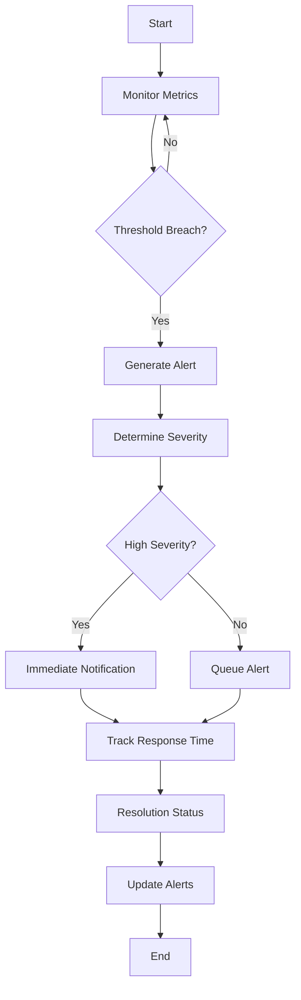

### **System Startup and Initialization Use Case**

**Use Case Description**: Initialize services, establish connections, and verify readiness for normal operation.

**Scope**: Prepare all components of the system for processing data.

**Level**: User Goal

**Primary Actor**: System Initialization Framework

**Stakeholders and Interests**:

- **System Administrators**: Require consistent and reliable system startup to minimize downtime.
- **Developers**: Need well-documented startup sequences to troubleshoot initialization issues.

**Preconditions**:

- Configuration files and environment variables are set up correctly.
- RabbitMQ, Prometheus, and Grafana are running.

**Postconditions**:

- All services are initialized and ready for operation.
- Connections to RabbitMQ, monitoring systems, and file directories are established.

**Main Success Scenario Step by Step**:

1. Each service starts and loads its configuration.
2. Services establish connections to RabbitMQ.
3. Services verify the availability of required directories (e.g., input, output, archive).
4. Monitoring endpoints (e.g., `/actuator/health`) are exposed for Prometheus.
5. Services log their readiness status.
6. The system enters operational mode.

**Extensions, Other Scenarios, and Alternatives**:

- **E1: Connection to RabbitMQ Fails**:
    - Retry the connection after a configurable interval.
    - Log the failure and escalate to administrators if retries exceed the limit.
- **E2: Missing Configuration**:
    - Log the issue and terminate the affected service.
    - Notify administrators to correct the configuration.

**Special Requirements**:

- Provide administrators with a startup log summarizing the initialization status of all services.
- Include retry mechanisms for establishing external connections.

**Data Variation List**:

- Configuration details (e.g., RabbitMQ credentials, directory paths).
- Health status logs.

**Frequency Occurrence**: Once during service startup or when manually triggered.

**Trigger**: Service startup or manual invocation.

**Actors**:

- **Primary**: System Initialization Framework
- **Supporting**: RabbitMQ, File System, Monitoring Systems

**Goals**:

- Ensure all components are ready for normal operation with minimal errors.

**Failed Endings**:

- Services fail to start or remain in a degraded state due to unresolved initialization issues.

**Miscellaneous**:

- Future improvement: Implement a centralized orchestration tool to manage the startup sequence.
- Consider adding self-healing mechanisms for common initialization failures.

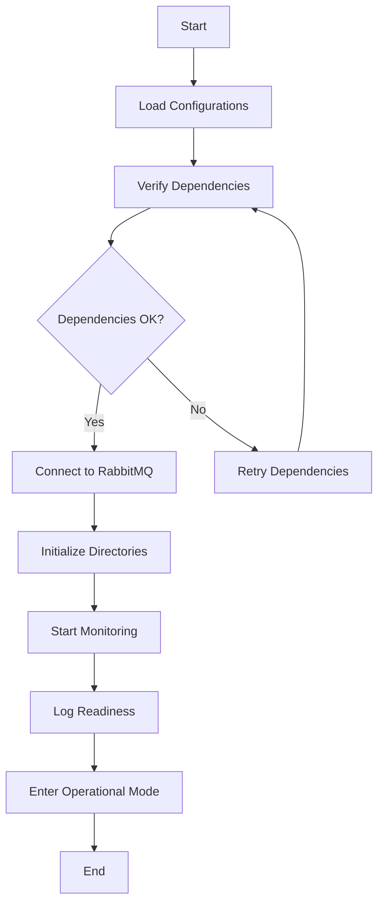

### **File Cleanup Use Case**

**Use Case Description**: Perform periodic cleanup of archived files across multiple service instances, adhering to the one-week retention policy.

**Scope**: Instance-specific directory cleanup operations within a distributed system.

**Level**: Subfunction

**Primary Actor**: Cleanup Scheduler

**Stakeholders and Interests**:

- **System Administrators**: Require automated file cleanup to maintain storage efficiency and avoid manual intervention.
- **Developers**: Need clear policies for managing file lifecycles in distributed service instances.
- **Business Stakeholders**: Depend on efficient file handling to prevent disruptions due to storage issues.

**Preconditions**:

- Each service instance has a configured archive directory with a standardized structure.
- The retention period for archived files (e.g., one week) is defined in the system configuration.
- Cleanup Scheduler is configured and operational.

**Postconditions**:

- Files older than the defined retention period are deleted from the respective archive directories.
- Logs are generated for all cleanup operations, including errors.

**Main Success Scenario Step by Step**:

1. The Cleanup Scheduler triggers a cleanup job according to the configured schedule.
2. The job iterates over each service instance:
    - Accesses the archive directory associated with the instance.
    - Identifies files older than the defined retention period.
3. For each eligible file:
    - Log the file’s metadata (e.g., name, size, timestamp).
    - Delete the file securely to prevent data recovery.
4. Generate a summary report for the cleanup operation, detailing:
    - Number of files deleted per instance.
    - Any errors encountered during the operation.
5. Store the cleanup logs for auditing and troubleshooting purposes.

**Extensions, Other Scenarios, and Alternatives**:

- **E1: Directory Access Fails**:
    - Log the failure and retry accessing the directory after a configurable interval.
    - Escalate to administrators if retries fail.
- **E2: File Deletion Fails**:
    - Log the failure with file details.
    - Skip the problematic file and continue with the next one.
- **E3: Retention Policy Change**:
    - Adjust the retention period dynamically based on administrator input.
    - Apply the new policy during the next cleanup cycle.

**Special Requirements**:

- Cleanup policies must be instance-specific to align with distributed directory structures.
- Logs should include instance identifiers for clear traceability.
- Files must be deleted securely to meet compliance requirements.

**Data Variation List**:

- Input: Files in instance-specific archive directories with timestamps in their names.
- Output: Logs of deleted files and summary reports.

**Frequency Occurrence**: Scheduled execution, typically daily or weekly.

**Trigger**: Scheduled task in the Cleanup Scheduler.

**Actors**:

- **Primary**: Cleanup Scheduler
- **Supporting**: File System, System Administrators

**Goals**:

- Maintain storage efficiency by regularly removing expired files.
- Ensure traceability of cleanup operations across multiple service instances.

**Failed Endings**:

- Expired files remain in the archive directories due to directory access or file deletion failures.

**Miscellaneous**:

- Future improvement: Integrate cleanup metrics with Grafana to visualize storage usage trends and cleanup efficiency.
- Consider implementing notifications for cleanup failures or excessive files in archive directories.

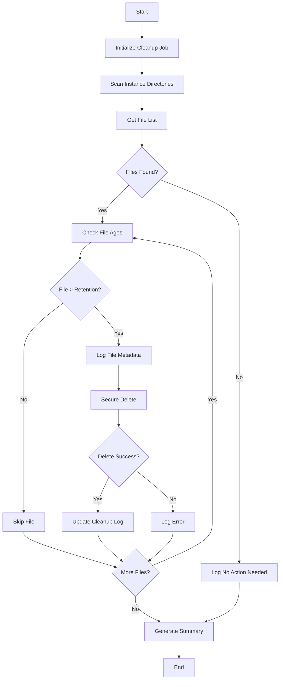

### **Message Retry Mechanism Use Case**

**Use Case Description**: Retry failed message deliveries based on a defined policy to ensure reliable processing.

**Scope**: Manage retries for message publishing and consumption in RabbitMQ.

**Level**: Subfunction

**Primary Actor**: RabbitMQ Retry Handler

**Stakeholders and Interests**:

- **System Administrators**: Require visibility into retry operations and success rates.
- **Developers**: Need detailed logs to debug recurring failures.
- **Business Stakeholders**: Depend on reliable message delivery to prevent data loss.

**Preconditions**:

- RabbitMQ is operational and configured with retry policies.
- Messages are flagged as failed after the initial processing attempt.

**Postconditions**:

- Successfully retried messages are processed and acknowledged.
- Messages that exceed retry limits are moved to the Dead Letter Queue (DLQ).

**Main Success Scenario Step by Step**:

1. RabbitMQ detects a message delivery failure and flags the message for retry.
2. The retry handler waits for the configured backoff period (e.g., exponential backoff).
3. After the wait period, RabbitMQ reattempts message delivery to the consumer.
4. The consumer processes the message successfully and acknowledges it.
5. RabbitMQ removes the message from the queue.

**Extensions, Other Scenarios, and Alternatives**:

- **E1: Retry Limit Exceeded**:
    - Move the message to the DLQ.
    - Log the failure with detailed context for debugging.
- **E2: Consumer Unavailable**:
    - Retry the connection after a configurable interval.
    - Log each failed attempt.

**Special Requirements**:

- Support configurable backoff strategies (e.g., fixed, incremental, exponential).
- Provide metrics for retry counts and success rates.

**Data Variation List**:

- Input: Failed messages with metadata (e.g., failure reason, retry count).
- Output: Successfully processed messages or messages routed to the DLQ.

**Frequency Occurrence**: Real-time, triggered by message delivery failures.

**Trigger**: Detection of a failed message delivery in RabbitMQ.

**Actors**:

- **Primary**: RabbitMQ Retry Handler
- **Supporting**: RabbitMQ, Consumer Services, Logging Framework

**Goals**:

- Ensure reliable message delivery through automated retries.

**Failed Endings**:

- Messages are moved to the DLQ after exhausting retry attempts.

**Miscellaneous**:

- Future improvement: Implement retry policies specific to message types or priority levels.
- Consider adding alerts for messages moved to the DLQ after exceeding retry limits.

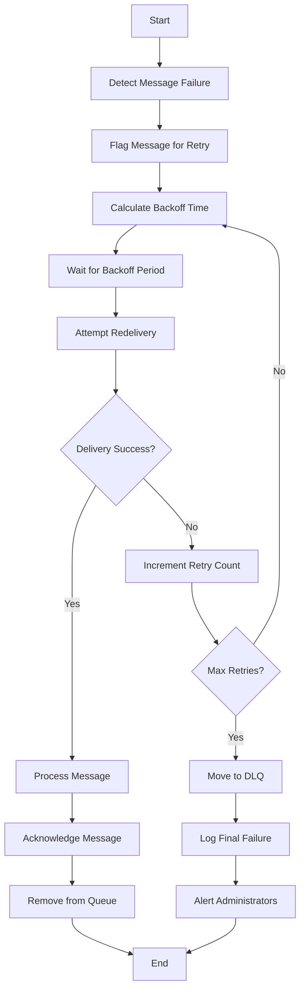
### **Staggered Scheduling for Distributed Services Use Case**

**Use Case Description**: Schedule tasks across multiple RMS Integration Service instances to prevent resource contention and ensure efficient processing.

**Scope**: Management of distributed task execution for PAS data retrieval and processing.

**Level**: Subfunction

**Primary Actor**: Scheduling Framework

**Stakeholders and Interests**:

- **System Administrators**: Require a predictable and balanced execution of tasks to optimize resource usage.
- **Developers**: Need visibility into the scheduling process for debugging and performance optimization.
- **Business Stakeholders**: Depend on timely and reliable data retrieval and processing without delays caused by overlapping tasks.

**Preconditions**:

- Multiple RMS Integration Service instances are operational.
- Each instance is configured with a unique store group assignment and schedule.
- The scheduling framework is configured with staggered intervals.

**Postconditions**:

- PAS data retrieval tasks are executed without overlapping or resource contention.
- Logs are generated for each task execution, including start and end times.

**Main Success Scenario Step by Step**:

1. The scheduling framework initializes on service startup.
2. Each RMS Integration Service instance registers its store group assignment and available resources with the scheduler.
3. The scheduler assigns a staggered execution interval to each service instance (e.g., one instance starts every 10 minutes).
4. At the scheduled time:
    - The service instance retrieves PAS data from the RMS REST API.
    - Transforms and publishes the data to RabbitMQ.
    - Logs the task completion status.
5. The scheduler tracks task statuses to ensure all instances execute successfully.

**Extensions, Other Scenarios, and Alternatives**:

- **E1: Task Execution Fails**:
    - Log the failure with detailed context.
    - Retry the task after a configurable interval or escalate to administrators.
- **E2: Scheduling Conflict**:
    - Detect overlapping tasks and reschedule the conflicting instance.
- **E3: Instance Unavailable**:
    - Log the unavailability and notify administrators.
    - Reassign the task to another available instance if feasible.

**Special Requirements**:

- The scheduler must support configurable intervals and dynamic rebalancing of tasks.
- Logs should include timestamps, service instance IDs, and task execution details for auditing.

**Data Variation List**:

- Input: Store group assignments and schedules.
- Output: Logs and metrics for task execution.

**Frequency Occurrence**: Daily or as configured for PAS data retrieval.

**Trigger**: Service startup or manual invocation of the scheduler.

**Actors**:

- **Primary**: Scheduling Framework
- **Supporting**: RMS Integration Service Instances, RMS REST API

**Goals**:

- Ensure efficient and balanced task execution across distributed services.
- Prevent system-wide resource contention.

**Failed Endings**:

- PAS data retrieval tasks fail to execute due to scheduling conflicts or instance unavailability.

**Miscellaneous**:

- Future improvement: Integrate the scheduling framework with the monitoring system to visualize task execution in real time.
- Consider implementing adaptive scheduling based on historical execution metrics.

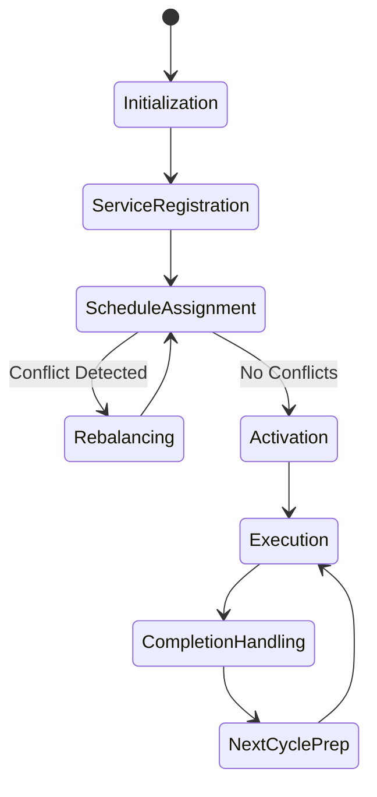

